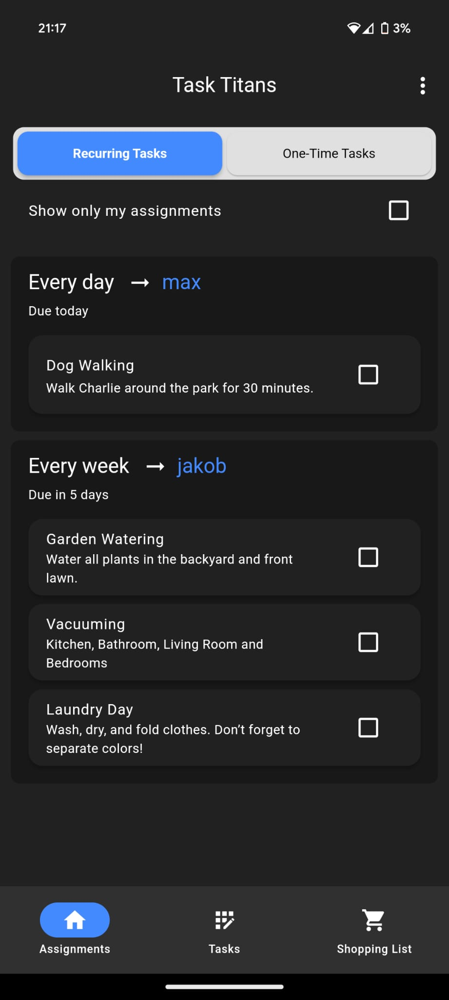
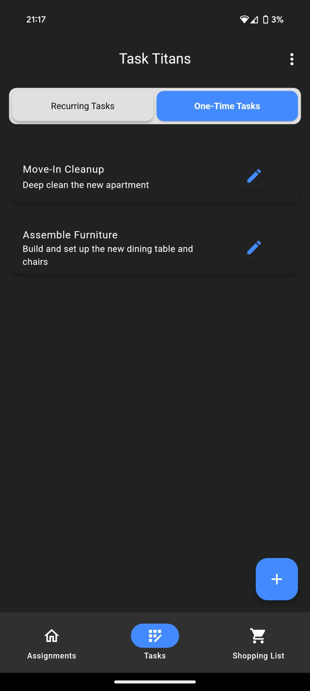
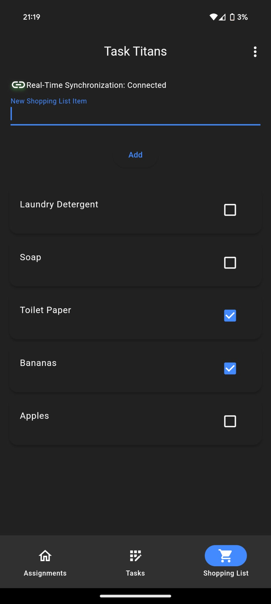

# 🏠 Flatshare

Simplify living in a shared apartment!
**Flatshare** helps you manage tasks, shopping lists, and more—effortlessly and without clutter.

It's **completely free**, **open source**, with **no ads** and **non-intrusive to your privacy**.

  
  
  

---

## 🌟 Key Features

✔️ **Recurring & One-Off Tasks**
- Set recurring tasks that auto-assign to group members daily, weekly, or monthly.
- Manage one-time assignments effortlessly.

✔️ **Real-Time Shopping List**
- A shared shopping list updated instantly for everyone in your group.

✔️ **User Group Management**
- Create or join groups.
- Invite others via an easy-to-share invite code or link.

✔️ **Task Notifications**
- Get notified when you are assigned a new task.

---

## 📥 Installation

> [!NOTE]
> Flatshare will soon be published on the App Store and the Google Play store

### iOS
Download via [TestFlight](https://testflight.apple.com/join/evmP9jag).

### Android
Get the latest APK from the [Releases](https://github.com/invertedEcho/flatshare/releases) tab.

---

## 🚀 Coming Soon

💡 **Multiple User Groups**
- Seamlessly manage multiple shared apartments or groups.

💡 **Vacation Mode**
- Mark users as "on vacation" to adjust task assignments accordingly.

💡 **Expense Tracker**
- Keep tabs on shared expenses with an integrated shopping list tracker.

---

## 🛠️ Tech Stack

**Backend:**
- 🚀 [pnpm](https://pnpm.io/)
- 🌐 [NestJS](https://nestjs.com/)
- ⚡ [drizzle](https://orm.drizzle.team/)

**Frontend:**
- 📱 [Flutter](https://flutter.dev/)

---

## 📝 Development Setup

- **Backend Setup:** Check the [backend/README.md](backend/README.md) for detailed setup instructions for the backend.
- **Frontend Setup:** Check the [frontend/README.md](frontend/README.md) for detailed setup instructions for the frontend.
